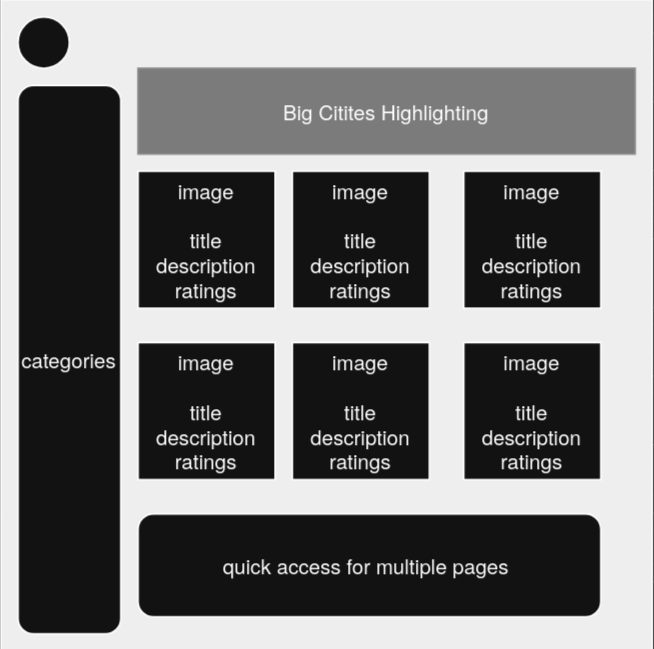

# Requirement Analysis in Software Development

The Requirement Analysis Project focuses on crafting a comprehensive foundation for software development by documenting, analyzing, and structuring requirements. Through a series of well-defined tasks, learners will create a detailed blueprint of the requirement analysis phase for a booking management system. This project simulates a real-world development scenario, emphasizing clarity, precision, and structure in defining requirements to set the stage for successful project execution.

## What is Requirement Analysis

Requirement Analysis is the process of understanding, documenting, and validating the needs and expectations of stakeholders (such as clients, users, or the product team) for a software application. It is a critical and foundational phase in the Software Development Life Cycle (SDLC).

## Why is Requirement Analysis Important?

Requirement Analysis plays a critical role in software development for several key reasons:

1. **Improves Communication Between Stakeholders and Developers**
   - Ensures that developers understand what users want and expect, reducing misunderstandings.

2. **Minimizes Risk of Rework**
   - Clear and validated requirements reduce the chances of implementing incorrect or incomplete features.

3. **Provides a Blueprint for Design and Testing**
   - Acts as a reference point for creating technical designs, test cases, and verification plans.

## Key Activities in Requirement Analysis

- **Requirement Gathering**
  - Collecting information from stakeholders through interviews, surveys, or documentation review.

- **Requirement Elicitation**
  - Proactively discovering and clarifying requirements using techniques like brainstorming, use case creation, or prototyping.

- **Requirement Documentation**
  - Clearly writing down the gathered requirements in a structured form such as user stories, functional specs, or diagrams.

- **Requirement Analysis and Modeling**
  - Analyzing requirements for completeness and consistency; modeling them using flowcharts, use case diagrams, or ER models.

- **Requirement Validation**
  - Confirming that documented requirements match stakeholder expectations and can be realistically implemented.

## Types of Requirements

### Functional Requirements

These define **what the system should do** — its behaviors, actions, or features.

**Examples (Booking Management Project):**
- Users can sign up, log in, and manage their profiles.
- Hosts can list new properties and update availability.
- Guests can search for listings, book a property, and make payments.

### Non-functional Requirements

These define **how the system should perform** — quality attributes or system constraints.

**Examples (Booking Management Project):**
- The system should handle at least 500 concurrent users.
- Booking confirmation emails should be sent within 1 minute of payment.
- The web application should be mobile-responsive and accessible on all major browsers.

## Use Case Diagrams

**Use Case Diagrams** visually represent the interactions between users (actors) and a system. They help communicate functionality at a high level and are useful for both technical and non-technical stakeholders.

**Benefits:**
- Simplifies understanding of system scope
- Identifies all possible interactions in early development stages
- Helps in test planning and validation

**Booking System Use Case Diagram:**

## Acceptance Criteria

**Acceptance Criteria** define the conditions under which a feature is considered complete and acceptable by stakeholders. They are essential for ensuring that development aligns with business goals and user expectations.

**Importance:**
- Clarifies expectations and reduces ambiguity
- Enables testable, measurable validation of features
- Serves as a basis for user story completion in Agile workflows

**Example: Checkout Feature (Booking Management System):**
